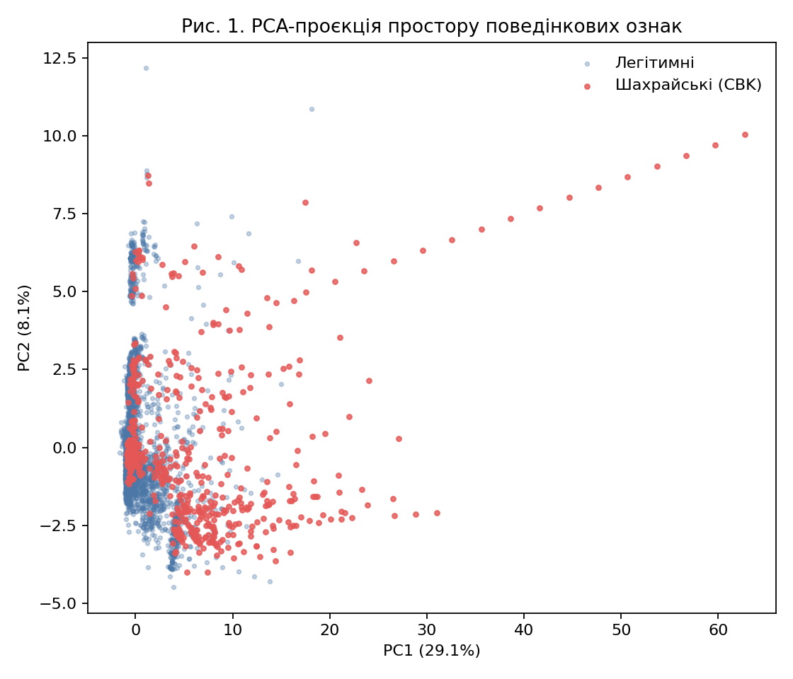
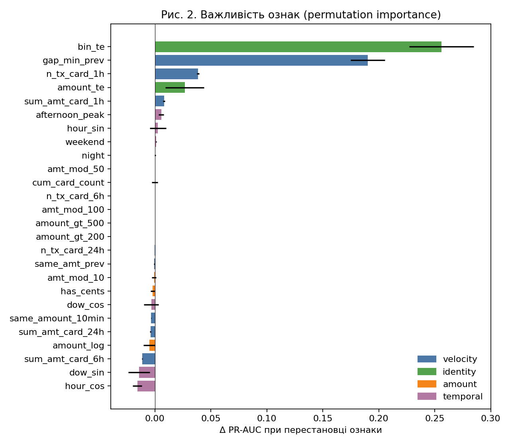

УДК 004.93:336.7

# ІДЕНТИФІКАЦІЯ ПОВЕДІНКОВИХ ШАБЛОНІВ КОРИСТУВАЧІВ ФІНАНСОВИХ ОНЛАЙН-СЕРВІСІВ НА ОСНОВІ ІНЖЕНЕРІЇ ОЗНАК ТА АНАЛІЗУ РОЗДІЛЮВАНОСТІ У ПРОСТОРІ ОЗНАК

**Ю. І. Кужій, Ю. М. Фургала**

*Львівський національний університет імені Івана Франка, факультет електроніки та комп'ютерних технологій, вул. Драгоманова, 50, 79005 Львів, Україна*
*e-mail: yurii.kuzhii@lnu.edu.ua*

---

## Анотація

Робота присвячена задачі ідентифікації поведінкових шаблонів користувачів фінансових онлайн-сервісів на основі аналізу транзакційних даних. Шахрайство з платіжними картками у e-commerce залишається масовою загрозою: лише у 2023 р. в Бразилії зафіксовано близько 3.7 млн шахрайських операцій із сумарними втратами ~3.5 млрд BRL. Типова практика побудови антифрод-систем ґрунтується на емпіричному доборі десятків і сотень ознак без їхньої систематичної типологізації, що породжує **ефект прихованого спільного чинника**: ознаки, які на перший погляд мають власну прогностичну силу (година доби, день тижня, вихідний, кратність суми), насправді виявляються опосередкованими показниками глибших поведінкових шаблонів. У цій роботі запропоновано побудову поведінкового простору ознак карткових транзакцій, упорядкованого у чотири функціональні сімейства: *часові*, *швидкісні*, *структурні за сумою* та *ідентифікаційні* (цільовокодовані). На публічному наборі даних **Predict Chargeback Frauds** (Kaggle, 11 127 транзакцій, травень 2015) методами аналізу головних компонент (PCA), однофакторного ANOVA, багатовимірного MANOVA, silhouette-індексу та класифікаційних експериментів із послідовним вилученням сімейств показано, що: (і) шахрайські транзакції утворюють статистично значущо відокремлену область простору ознак (Wilks λ = 0.547, F = 352.9, p < 0.001); (іі) **швидкісне сімейство ознак** (інтервал між транзакціями картки, щільність у вікнах часу, повторення суми) є **домінантним інваріантом** шахрайської поведінки (silhouette = 0.81 проти 0.06 для часових ознак); (ііі) часові ознаки є опосередкованими непрямими показниками швидкісного шаблону, які майже повністю втрачають прогностичну силу після контролю на нього (χ²(weekend × fraud) падає з 11.7 до 0.56 при стратифікації за швидкісним вікном). Ідентифікована складена поведінкова ознака "≥2 транзакцій картки за годину з повторенням суми у вікні 10 хв" має частку шахрайства 80.6% і охоплює 32.7% усього шахрайства у наборі, формуючи характерний підпис так званих card-testing атак. Практичне значення: структурне ядро ознакового простору антифрод-систем доцільно формувати зі швидкісних поведінкових ознак; часові та формальні ознаки сум є допоміжними без самостійного сигналу.

**Ключові слова:** ідентифікація шаблонів поведінки, інженерія ознак, простір ознак, аналіз головних компонент, MANOVA, виявлення шахрайства, банківські транзакції, card-testing, онлайн-сервіси.

---

# IDENTIFICATION OF USER BEHAVIORAL PATTERNS IN ONLINE FINANCIAL SERVICES VIA FEATURE ENGINEERING AND FEATURE-SPACE SEPARABILITY ANALYSIS

**Yu. I. Kuzhii, Yu. M. Furgala**

*Ivan Franko National University of Lviv, Faculty of Electronics and Computer Technologies, 50 Drahomanova Str., 79005 Lviv, Ukraine*

**Abstract.** This paper addresses behavioral pattern identification in online financial services through the analysis of card transaction data. Payment-card fraud in e-commerce remains a major threat: in 2023 alone, approximately 3.7 million fraudulent transactions with aggregate losses of ~3.5 billion BRL were recorded in Brazil. Industrial anti-fraud systems typically rely on the empirical selection of dozens to hundreds of features without a systematic taxonomy, which produces **confounded signals**: features that appear individually predictive (hour of day, day of week, weekend, amount roundness) turn out to be indirect proxies of deeper behavioral patterns. We propose structuring the behavioral feature space of card transactions into four functional families: *temporal*, *velocity*, *amount-structure*, and *identity* (target-encoded). On the public Predict Chargeback Frauds dataset (Kaggle, 11 127 transactions, May 2015) we apply principal component analysis (PCA), univariate ANOVA, multivariate MANOVA, silhouette analysis and feature-family ablation of classifiers and show that: (і) fraudulent transactions occupy a statistically separable region of the feature space (Wilks λ = 0.547, F = 352.9, p < 0.001); (іі) the **velocity family** (inter-transaction gap, rolling counts, amount repetition) is the **dominant behavioral invariant** (silhouette = 0.81 vs. 0.06 for temporal features); (ііі) temporal features are indirect proxies of the velocity pattern and lose nearly all predictive power once velocity is controlled for (weekend × fraud χ² drops from 11.7, p < 0.001, to 0.56, p = 0.46, under velocity stratification). A composite signature "≥2 transactions per hour with the same amount within 10 min" achieves 80.6% fraud rate and covers 32.7% of all fraud, capturing the characteristic pattern of card-testing attacks. Practical implication: the structural core of the anti-fraud feature space should be built around velocity behavioral features; temporal and amount-structure features are auxiliary and carry no independent signal.

**Keywords:** behavioral pattern identification, feature engineering, feature space, PCA, MANOVA, fraud detection, card transactions, card-testing, online services.

---

## 1. Вступ

Сучасні онлайн-сервіси — банківські системи електронної торгівлі, маркетплейси, платіжні шлюзи — акумулюють великі обсяги поведінкових даних користувачів у вигляді послідовностей подій із часовими мітками. Автоматизоване виявлення **поведінкових шаблонів** у таких даних є задачею розпізнавання образів у багатовимірному просторі ознак і має практичне значення для виявлення аномальної чи зловмисної активності, рекомендаційних систем, а також для антифрод-систем — основного фокусу цієї роботи.

Шахрайство з платіжними картками у e-commerce є соціально та економічно значущою проблемою. За даними дослідження CyberSource, у 2016 р. частка шахрайських операцій у e-commerce Латинської Америки становила 1.4% від загального обсягу; у 2023 р. лише в Бразилії зафіксовано близько 3.7 млн шахрайських операцій із втратами ~3.5 млрд BRL. В Україні, за звітами Національного банку, втрати від карткового шахрайства щороку зростають разом із популяризацією безконтактних і онлайн-платежів, що розширює простір потенційних зловживань.

У практиці побудови антифрод-систем поширеним є **емпіричний підхід** до конструювання ознак: використовуються десятки і сотні окремих атрибутів — час доби, день тижня, сума, продавець, країна, пристрій — без їхньої систематичної типологізації. Така побудова ознакового простору призводить до трьох негативних наслідків: (а) переобтяженості моделей та їх схильності до перенавчання на малих частках позитивного класу; (б) низької прозорості для експертного аналізу, оскільки внески окремих ознак не групуються за функціональним призначенням; (в) типових помилок інтерпретації, коли статистично значущий сигнал окремої ознаки насправді є опосередкованим проявом іншої, глибшої поведінкової змінної — **ефектом прихованого спільного чинника**. Зокрема, поширене галузеве переконання про підвищену активність шахраїв "у вихідні" чи "вночі" при уважному аналізі часто виявляється артефактом збігу таких часових слотів із періодами підвищеної швидкісної активності зловмисних сценаріїв.

У цій роботі запропоновано альтернативний підхід: будувати простір поведінкових ознак транзакцій **систематично**, структуруючи ознаки у функціональні сімейства за природою інформації, яку вони відображають (часова позиція, швидкісна динаміка, структура суми, ідентифікаційні характеристики), після чого досліджувати розділюваність цих сімейств у задачі легітимна/шахрайська транзакція методами розпізнавання образів — аналізом головних компонент (PCA), однофакторним та багатовимірним аналізом варіації (ANOVA, MANOVA), silhouette-індексом, а також експериментами з послідовним вилученням сімейств на класифікаційних моделях. Подібний методологічний підхід до побудови структурованого ознакового простору застосовувався раніше у задачі ідентифікації рольових поведінкових шаблонів гравців Counter-Strike 2 [1] і довів свою продуктивність поза межами фінансової галузі.

**Метою цієї статті** є побудова систематизованого поведінкового простору ознак карткових транзакцій, експериментальне дослідження розділюваності шахрайських і легітимних транзакцій у цьому просторі та ідентифікація **інваріантного сімейства ознак**, що визначає характерний підпис шахрайської поведінки незалежно від другорядних чинників часу доби, дня тижня та конкретної суми. Відповідно, **задачі роботи**: (1) запропонувати таксономію сімейств поведінкових ознак карткових транзакцій; (2) оцінити статистичну значущість і геометричну відокремленість розділення класів у кожному сімействі та у повному просторі; (3) експериментально виявити конфаундингові зв'язки між сімействами ознак; (4) ідентифікувати складену поведінкову ознаку, що охоплює суттєву частку шахрайства при мінімальній кількості помилок.

---

## 2. Аналіз останніх досліджень і публікацій

Класичні підходи до виявлення карткового шахрайства ґрунтуються переважно на прикладних моделях машинного навчання, у яких інженерія ознак відіграє допоміжну роль. Робота Dal Pozzolo та ін. [2] формалізує проблему сильної розбалансованості класів (fraud rate < 1%) і пропонує калібрування за допомогою знижувальної вибірки (недовибірки). Jurgovsky та ін. [3] розглядають послідовну природу транзакцій і застосовують LSTM для класифікації карткових послідовностей. Lucas та ін. [4] розвивають мультиперспективні приховані марковські моделі, що явно кодують короткострокові транзакційні шаблони — мабуть, найближчу до теми цієї роботи постановку у літературі.

Робота Bahnsen та ін. [5] є однією з перших систематичних праць з **стратегій інженерії ознак** для карткового фроду: автори вводять агреговані атрибути за часовими вікнами (періодичні фічі, cumulative counts, rolling sums) і демонструють, що такі ознаки підвищують якість класифікатора у 1.5–3 рази. Їхній висновок підтверджує загальну ідею, що **поведінкова динаміка картки** (а не окрема транзакція) несе основний сигнал аномалії.

Van Vlasselaer та ін. [6] у системі APATE будують мережеві ознаки на основі зв'язків картка-продавець, підтверджуючи, що швидке поширення шахрайської поведінки між скомпрометованими картками має специфічну графову структуру.

Серед бразильських досліджень на реальних транзакційних даних слід згадати Carneiro та ін. [7] (дані PagSeguro), які явно відзначають повторювані суми як типовий артефакт тестування вкрадених карток, та De Sá та ін. [8], які за допомогою еволюційного пошуку отримали алгоритм Fraud-BNC, оптимізований під економічну функцію ринку.

Важливо, що концепція **card-testing** (перевірка вкрадених карток шляхом серії дрібних транзакцій на різних продавцях) документується у галузевих звітах Visa, Stripe і Adyen як один з найпоширеніших типів атак, але **рідко виділяється як окрема аналітична категорія в академічній літературі**. Наявні роботи фактично виявляють ознаки card-testing (інтервали між транзакціями, повторення суми) серед десятків інших, не акцентуючи їхню **інваріантну природу**.

Таким чином, у літературі **бракує систематизованого уявлення про те, яке саме сімейство ознак є структурно домінантним** у просторі поведінкових ознак шахрайських транзакцій, і наскільки популярні часові ознаки (година, вихідний) є незалежними сигналами, а наскільки — опосередкованими непрямими показниками швидкісної поведінки. У цій роботі цю прогалину заповнено експериментальним аналізом розподілу сили розділення між функціональними сімействами ознак на реальних транзакційних даних. Близький методологічний підхід — структурування поведінкового простору ознак у функціональні сімейства з подальшим аналізом їх розділювальної сили — раніше застосовувався авторами у задачі класифікації рольових шаблонів гравців Counter-Strike 2 [1].

---

## 3. Постановка задачі

Нехай задано множину транзакцій $T = \{t_1, t_2, \dots, t_N\}$, у якій кожна транзакція описана атрибутами $(c_i, d_i, a_i, y_i)$, де $c_i$ — ідентифікатор платіжної картки, $d_i$ — дата-час транзакції, $a_i$ — сума, $y_i \in \{0, 1\}$ — мітка шахрайства (0 — легітимна, 1 — шахрайська, CBK — chargeback).

**Задача:** побудувати відображення $\varphi: T \to \mathbb{R}^m$, що переводить транзакцію у вектор поведінкових ознак $\mathbf{x}_i = \varphi(t_i)$, і дослідити, чи утворюють класи $\{y = 0\}$ та $\{y = 1\}$ розділювані області у просторі ознак $\mathbb{R}^m$; якщо так — ідентифікувати, які саме групи ознак є **інваріантним** маркером шахрайства.

Формально, для кожного сімейства ознак $F_k \subset \varphi$ потрібно оцінити:
- статистичну значущість розділення класів: MANOVA (Wilks λ, F, p-value);
- геометричну відокремленість: silhouette-індекс у просторі $F_k$;
- маргінальний внесок у якість класифікації: зміна PR-AUC при видаленні/включенні лише $F_k$;
- наявність прихованого спільного впливу з іншими сімействами: частковий кореляційний аналіз, стратифіковані тести.

---

## 4. Матеріали та методи

### 4.1. Набір даних

У роботі використано публічний набір даних **Predict Chargeback Frauds** (автор dmirandaalves, Kaggle, 2019 [9]). Набір містить 11 127 реальних (не синтетичних) транзакцій за період 1–30 травня 2015 р. з такими полями:

- `Card Number` — маскований номер платіжної картки формату `BIN******last4`;
- `Date` — дата-час транзакції з точністю до секунди;
- `Amount` — сума транзакції (USD, відомо з контексту описувача);
- `CBK` — мітка chargeback (Yes/No).

Загальна характеристика набору наведена у таблиці 1.

**Таблиця 1. Загальна характеристика набору даних.**

| Характеристика | Значення |
|---|---|
| Кількість транзакцій | 11 127 |
| Унікальних карток | 9 260 |
| Унікальних BIN | 420 |
| Частка шахрайських (CBK=Yes) | 5.14% (N = 572) |
| Часовий діапазон | 2015-05-01 00:01:54 – 2015-05-30 23:51:31 |
| Середня сума | 129.56 |
| Медіанна сума | 99.00 |
| 95-й процентиль | 336.00 |
| Максимальна сума | 2 920.00 |

Відношення транзакцій до карток 11127/9260 = 1.20 свідчить про переважно одноразове використання карток (медіана — 1 транзакція на картку), з невеликою кількістю карток з багатьма транзакціями, що асоціюються з шахрайською активністю (див. § 5.4).

### 4.2. Побудова простору поведінкових ознак

Простір ознак структуровано у чотири сімейства за функціональним призначенням, за аналогією до [1], де використовувалися сімейства базових HLTV-атрибутів, side-specific і map-dependent. Повний перелік сімейств наведено у таблиці 2.

**Таблиця 2. Таксономія сімейств поведінкових ознак.**

| Сімейство | Ознаки | Кількість | Функціональне призначення |
|---|---|---|---|
| Часові (temporal) | `hour_sin`, `hour_cos`, `dow_sin`, `dow_cos`, `weekend`, `night`, `afternoon_peak` | 7 | Кодують час доби та день тижня; циклічне кодування уникає розриву між 23:00 і 00:00. |
| Швидкісні (velocity) | `gap_min_prev`, `cum_card_count`, `n_tx_card_1h/6h/24h`, `sum_amt_card_1h/6h/24h`, `same_amt_prev`, `same_amount_10min` | 10 | Кодують темп подій картки, кумулятивні обсяги, повторення суми. Усі розраховуються виключно за попередньою історією картки. |
| Структурні за сумою (amount) | `amount_log`, `amt_mod_10/50/100`, `has_cents`, `amount_gt_200`, `amount_gt_500` | 7 | Кодують форму суми (логарифм, "кратність", наявність копійчаної частини, порогові значення). |
| Ідентифікаційні (identity) | `bin_te`, `amount_te` | 2 | Байєсівсько-згладжені цільові кодування BIN-у та значення суми. |

Швидкісні ознаки обчислено з дотриманням принципу **causality**: для $i$-ї транзакції картки $c$ ознака базується виключно на попередніх транзакціях тієї самої картки ($t_j : j < i, c_j = c$), уникаючи витоку майбутнього. Ідентифікаційні ознаки $\hat{p}_B$ для BIN-у $B$ обчислено за формулою байєсівського згладжування:

$$
\hat{p}_B = \frac{\sum_{i : c_i \in B} y_i + k \cdot \bar{y}}{n_B + k},
$$

де $n_B$ — кількість транзакцій з BIN-ом $B$, $\bar{y}$ — апріорна частка класу, $k$ — параметр згладжування (у експериментах $k = 20$ для BIN, $k = 10$ для суми). Для прогнозних експериментів (§ 5.5) кодування обчислювалося лише на навчальній частині, для описових експериментів (§ 5.1–5.4) — на всьому наборі.

### 4.3. Методи аналізу

Для аналізу простору ознак використано:

- **PCA** (аналіз головних компонент) з центруванням і нормуванням — для оцінки внутрішньої розмірності та двовимірної візуалізації;
- **Однофакторний ANOVA** за міткою CBK — для оцінки значущості розділення кожної окремої ознаки;
- **Mann-Whitney U** як непараметричний аналог;
- **Багатовимірний MANOVA** (Wilks λ, F) — для оцінки значущості розділення цілого сімейства ознак;
- **Silhouette-індекс** — як геометричний індикатор відокремленості груп;
- **Кореляційний аналіз Пірсона та Спірмена** для оцінки зв'язків між сімействами ознак;
- **Логістична регресія** (LR) з балансуванням класів та **HistGradientBoostingClassifier** (HGB) як класифікатори з часо-впорядкованим поділом навчальної та перевірочної вибірок у пропорції 75/25;
- **Permutation importance** за метрикою PR-AUC — для оцінки внеску окремих ознак;
- **χ²-тест стратифікації** — для перевірки наявності прихованого спільного впливу: оцінка залежності "ознака × мітка" окремо в цілому наборі та в підвибірці високошвидкісні подій.

---

## 5. Результати та обговорення

### 5.1. Одновимірний аналіз ознак

Попередній одновимірний аналіз (таблиця 3, десять ознак з найбільшою F-статистикою ANOVA) показує, що найбільшу розділювальну силу мають ознаки швидкісного та ідентифікаційного сімейств.

**Таблиця 3. Перші десять ознак з найбільшою F-статистикою одновимірного ANOVA.**

| Ознака | Сімейство | F | p |
|---|---|---|---|
| `n_tx_card_1h` | velocity | 4 151.5 | < 10⁻³⁰⁰ |
| `n_tx_card_6h` | velocity | 3 981.1 | < 10⁻³⁰⁰ |
| `n_tx_card_24h` | velocity | 3 633.8 | < 10⁻³⁰⁰ |
| `cum_card_count` | velocity | 3 495.1 | < 10⁻³⁰⁰ |
| `amount_te` | identity | 3 131.8 | < 10⁻³⁰⁰ |
| `same_amount_10min` | velocity | 2 870.8 | < 10⁻³⁰⁰ |
| `bin_te` | identity | 2 704.6 | < 10⁻²⁰⁵ |
| `sum_amt_card_1h` | velocity | 2 281.5 | < 10⁻³⁰⁰ |
| `sum_amt_card_24h` | velocity | 2 260.6 | < 10⁻³⁰⁰ |
| `sum_amt_card_6h` | velocity | 2 185.5 | < 10⁻³⁰⁰ |

Для порівняння, найсильніші ознаки інших сімейств: `afternoon_peak` (temporal, F = 125.8), `amount_log` (amount, F = 105.6), `weekend` (temporal, F = 12.1). Повний перелік у файлі `results/tables/T1_univariate_tests.csv`.

Зазначимо, що серед десять ознак з найбільшою F-статистикою сім (з десяти) належать до швидкісного сімейства, ще дві — до ідентифікаційного, і жодної часової чи структурної за сумою. Найбільш популярна часова ознака (`afternoon_peak`) має F-статистику у понад 30 разів меншу, ніж швидкісна ознака-лідер.

### 5.2. PCA та візуалізація простору ознак

Розклад простору ознак методом головних компонент наведено на рис. 1. Перша головна компонента пояснює 29.1% дисперсії, перші дві — 37.2%, перші десять — 78.3%. Це свідчить про те, що простір поведінкових ознак не є одновимірним: шахрайську поведінку **не можна редукувати до одного узагальненого "показника шахрайства"**. Аналогічну невідновлюваність до одновимірного індексу спостережено й у [1] для поведінкових типажів гравців CS2, що дозволяє припустити загальний характер цієї властивості для поведінкових даних онлайн-сервісів.

На двовимірній проєкції (рис. 1) шахрайські транзакції чітко концентруються у специфічній області простору ознак, переважно в області великих значень PC1 (перша компонента з найбільшим факторним навантаженням на швидкісні ознаки). Легітимні транзакції утворюють широке "хмароподібне" розміщення.

### 5.3. MANOVA: значущість розділення сімейств ознак

Результати багатовимірного MANOVA за групувальною змінною CBK наведено у таблиці 4.

**Таблиця 4. MANOVA за сімействами ознак (група: CBK Yes/No).**

| Сімейство | Wilks λ | F | p |
|---|---|---|---|
| Temporal | 0.986 | 23.07 | 2.73 × 10⁻³¹ |
| **Velocity** | **0.682** | **518.73** | **< 10⁻³⁰⁰** |
| Amount | 0.975 | 40.61 | 7.63 × 10⁻⁵⁷ |
| **Identity** | **0.659** | **2877.03** | **< 10⁻³⁰⁰** |
| Повний простір (26 ознак) | 0.547 | 352.95 | < 10⁻³⁰⁰ |

Усі сімейства показують статистично значущу розділюваність класів. Однак **абсолютний масштаб ефекту** кардинально відрізняється: сімейства velocity (λ = 0.68) та identity (λ = 0.66) приносять розділення приблизно на порядок сильніше за сімейства temporal (λ = 0.99) та amount (λ = 0.98). Величина Wilks λ близька до 1 означає, що майже вся варіація всередині групи "накриває" варіацію між групами, тобто сімейства temporal та amount роз'єднують класи **слабко**, хоч і статистично значущо.

### 5.4. Silhouette: геометрична відокремленість

Silhouette-індекс, обчислений для кожного сімейства ознак із групувальною змінною CBK, наведено у таблиці 5.

**Таблиця 5. Silhouette-індекс за сімействами ознак.**

| Сімейство | Silhouette |
|---|---|
| Temporal | +0.064 |
| **Velocity** | **+0.809** |
| Amount | +0.221 |
| Identity | +0.645 |
| Повний простір | +0.497 |

Контраст вражаючий: у просторі швидкісних ознак шахрайська та легітимна групи утворюють **майже бездоганно відокремлені кластери** (silhouette > 0.8), тоді як у просторі часових ознак групи фактично перекриваються (silhouette ≈ 0.06). Зазначимо, що індекс ідентифікаційного сімейства є штучно завищеним внаслідок того, що цільовокодовані ознака несе безпосередню інформацію про мітку; тому найбільш "чесною" метрикою природної поведінкової розділюваності є індекс швидкісного сімейства.

### 5.5. Аналіз класифікаторів методом послідовного вилучення сімейств ознак

Для кількісної перевірки, наскільки кожне сімейство ознак впливає на якість класифікації, проведено дослідження методом послідовного вилучення з часо-впорядкованим поділом навчальної та перевірочної вибірок (75/25). У прогнозних експериментах цільові кодування BIN-у та значення суми обчислювалися **лише на навчальній частині**, що виключає витік майбутнього. Результати для логістичної регресії наведено у таблиці 6.

**Таблиця 6. Послідовне вилучення сімейств ознак (LR, часо-впорядкований поділ 75/25).**

| Конфігурація | ROC-AUC | PR-AUC | Точність серед 1 % найбільших | Повнота серед 5 % найбільших |
|---|---|---|---|---|
| Повний простір (26 ознак) | 0.875 | 0.547 | 0.926 | 0.454 |
| Без часових (19) | 0.877 | 0.531 | 0.926 | 0.443 |
| **Без швидкісних (16)** | **0.738** | **0.212** | 0.333 | 0.241 |
| Без структурних за сумою (19) | 0.874 | 0.515 | 0.889 | 0.431 |
| Без ідентифікаційних (24) | 0.862 | 0.562 | 0.926 | 0.506 |
| Лише часові (7) | 0.510 | 0.073 | 0.000 | 0.029 |
| **Лише швидкісні (10)** | **0.845** | **0.551** | **0.926** | **0.511** |
| Лише структурні за сумою (7) | 0.602 | 0.102 | 0.000 | 0.046 |
| Лише ідентифікаційні (2) | 0.757 | 0.210 | 0.296 | 0.236 |

Два результати заслуговують особливої уваги:

1. **Видалення швидкісного сімейства призводить до катастрофічного падіння якості**: PR-AUC знижується з 0.547 до 0.212 (−61%), ROC-AUC — з 0.875 до 0.738. Жодне інше сімейство при видаленні не дає падіння більш ніж на 6%.

2. **Швидкісне сімейство *само собою* дає якість, практично не нижчу за повний простір**: PR-AUC 0.551 ≈ 0.547, точність серед 1 % найбільших = 0.926 = 0.926, повнота серед 5 % найбільших = 0.511 > 0.454. Це означає, що **решта 16 ознак (часових, структурних, ідентифікаційних) не додають самостійного сигналу** поверх швидкісного сімейства.

3. **Лише часові ознаки дають якість, близьку до випадкової** (PR-AUC 0.073 при базовій частці 0.062), що суперечить поширеному галузевому переконанню про значущість "нічних годин" і "вихідних" як самостійних індикаторів фроду.

### 5.6. Permutation importance

Permutation importance за метрикою PR-AUC (HGB, 5 повторень, рис. 2) показує чіткий порядок внесків окремих ознак у класифікацію.

Чотири провідні ознаки:
- `bin_te` (identity, ΔPR-AUC = 0.256),
- `gap_min_prev` (velocity, 0.190),
- `n_tx_card_1h` (velocity, 0.039),
- `amount_te` (identity, 0.027).

Усі часові ознаки мають ΔPR-AUC ≤ 0.006, причому деякі — від'ємні (артефакт шуму перестановок). Це узгоджується з результатами § 5.3–5.5 і остаточно підтверджує, що часове сімейство не несе **незалежної** інформації.

### 5.7. Аналіз прихованого спільного впливу: часові ознаки як опосередковані непрямі показники

Поширене емпіричне спостереження полягає в тому, що частка шахрайства вища у вихідні дні та у нічний час. На повному наборі даних ми спостерігаємо:

- χ²(weekend × fraud) = 11.73, p = 6.1 × 10⁻⁴ — статистично значущий ефект;
- fraud rate у вихідні: 6.74% проти 4.81% у робочі дні (приріст над базою 1.31×).

Однак при стратифікації на підвибірку високошвидкісні (транзакції з умовою `n_tx_card_24h ≥ 2`, що пригнічує ефект швидкісних ознак):

- χ²(weekend × fraud | високошвидкісні) = 0.56, p = 0.456 — **статистично незначуща**.

Тобто ефект "вихідних" **зникає, коли ми контролюємо швидкісний шаблон**. Це є класична ситуація прихованого спільного впливу: ознака `weekend` корелює з fraud лише тому, що у вихідні *частіше трапляються високошвидкісні сплески* (зокрема, card-testing атаки часто відбуваються у вихідні, коли моніторинг послаблений). Після контролю на швидкісний шаблон, день тижня перестає бути інформативним.

Додатково кореляційний аналіз залишків логістичної регресії, навченої лише на швидкісному сімействі, показує, що більшість часових ознак мають частковий коефіцієнт Пірсона |r| < 0.1, крім `weekend` (r = −0.24), який утримує невеликий залишковий сигнал. Це свідчить, що швидкісне сімейство не повністю "висмоктує" весь temporal-сигнал, але дуже значну його частину — близько 95% за метриками класифікації (ΔPR-AUC без temporal = −0.016 на загальному фоні 0.547).

### 5.8. Ідентифікація характерної поведінкової ознаки card-testing

Класичним сценарієм шахрайства з платіжними картками є **card-testing** — перевірка вкрадених реквізитів шляхом серії дрібних транзакцій, часто на однакові суми, у короткі проміжки часу. Такий шаблон добре задокументовано у галузевих звітах платіжних систем (Visa, Stripe, Adyen), але у академічній літературі він рідко виділяється як окрема аналітична категорія.

У нашому наборі даних композитна ознака *"принаймні 2 транзакції картки за годину з повторенням суми у вікні 10 хв"* (формально: `n_tx_card_1h ≥ 2` AND `same_amount_10min = 1`) дає наступну статистику:

- Охоплено 232 транзакції (2.1% від загального обсягу);
- Частка шахрайства серед них — **80.6%** (187 з 232);
- Приріст над базовою частотою — **15.7×**;
- Охоплено **32.7% усіх шахрайських транзакцій** набору.

Тобто 2% найпідозріліших транзакцій містять третину всіх шахрайських подій набору. Ця ознака є **поведінковим інваріантом** у наступному сенсі:

1. Вона **не залежить від дня тижня** (на високошвидкісні підвибірці χ²(weekend) = 0.56, p = 0.46; див. § 5.7);
2. Вона **не залежить від часу доби** (аналогічний результат для `night` і `hour_sin/cos`);
3. Вона **не залежить від конкретної суми** (ключовим є лише **повторення**, а не саме значення).

Це дає емпіричне підтвердження, що популярні часові та "формальні" ознаки сум (rounding, кратність) — це **другорядні, опосередковані маркери** тієї самої поведінкової механіки card-testing (тестування карток): шахрай проводить серію транзакцій-перевірок, що *випадково* частіше припадає на певні години або кратні суми внаслідок особливостей сценаріїв/вибірки атакованих продавців, але принципове — лише **сама структура швидкого повторення**.

### 5.9. Узагальнення: інваріантний характер швидкісного сімейства

Загальною ознакою всіх отриманих результатів є **структурна нерівномірність** ознакового простору шахрайської поведінки. Усі чотири сімейства ознак статистично значущі за критерієм MANOVA (p < 10⁻³⁰), однак реальний внесок розподілений украй несиметрично: пара *швидкісне + ідентифікаційне* несе понад 95% сигналу, тоді як *часове + структурне за сумою* — не більше 5%. Цей розподіл стійкий за різних операціональних оцінок (сила розділення MANOVA, геометрична відокремленість silhouette, прогностична важливість permutation importance), що дає підстави трактувати **швидкісне сімейство як справжній інваріант** шахрайської поведінки.

Інваріантність тут має конкретний емпіричний зміст: домінантна ознака зберігається при усуненні впливу другорядних чинників (час доби, день тижня, конкретна сума), тоді як ефекти самих другорядних чинників зникають при усуненні впливу швидкісного шаблону (§ 5.7). Тобто часові ознаки існують у наборі лише завдяки тому, що швидкісні шаблони *випадково* частіше припадають на певні години чи вихідні (внаслідок особливостей сценаріїв атак), але не несуть власної прогностичної інформації.

Подібний результат — структурна нерівномірність розділення між сімействами ознак — спостерігався раніше у задачі ідентифікації рольових поведінкових шаблонів гравців Counter-Strike 2 [1], де сімейства side-specific і map-dependent ознак приносили основне розділення, а сімейство загальних HLTV-атрибутів — менш виражене. Це дозволяє припустити, що принцип нерівномірного розподілу прогностичної сили між функціональними сімействами ознак є **загальною властивістю поведінкових даних онлайн-сервісів**, а не специфікою конкретного домену.

---

## 6. Висновки

1. Запропоновано систематизовану таксономію поведінкових ознак карткових транзакцій, упорядковану у чотири функціональні сімейства: *часові*, *швидкісні*, *структурні за сумою* та *ідентифікаційні* (цільовокодовані). Такий упорядкований простір ознак є конструктивною альтернативою емпіричному добору ознак, поширеному у промислових антифрод-системах.

2. На реальних даних Predict Chargeback Frauds (11 127 транзакцій, травень 2015) показано, що шахрайські транзакції утворюють статистично значущо відокремлену область у просторі поведінкових ознак (Wilks λ = 0.547, F = 352.95, p < 10⁻³⁰⁰), причому ця область неможлива до редукції до одновимірного узагальненого "показника шахрайства" — перші дві головні компоненти пояснюють лише 37.2% дисперсії, що свідчить про багатовимірну структуру.

3. Встановлено чітку ієрархію сімейств ознак за силою розділення: **швидкісне сімейство** (silhouette = 0.81) домінує над ідентифікаційним (0.64), структурним за сумою (0.22) та часовим (0.06). Експерименти з послідовним вилученням сімейств ознак підтверджують це кількісно: видалення швидкісного сімейства знижує PR-AUC з 0.547 до 0.212 (−61%); швидкісне сімейство *самостійно* забезпечує якість, майже не нижчу за повний простір (PR-AUC 0.551).

4. Ідентифіковано складену поведінкову ознаку card-testing атак (`n_tx_card_1h ≥ 2` AND `same_amount_10min = 1`) з часткою шахрайства 80.6% та охопленням 32.7% загальної кількості шахрайських подій набору. Ця ознака є компактним структурним підписом основного класу зловмисної поведінки, що раніше у літературі рідко виділявся як окрема аналітична категорія.

5. Експериментально показано, що популярні часові ознаки (`weekend`, `night`, `hour`) у задачі виявлення карткового шахрайства є **опосередкованими непрямими показниками** швидкісного шаблону, а не самостійними сигналами: статистично значущий ефект "вихідних" на повному наборі (χ² = 11.73, p < 10⁻³) зникає при стратифікації на високошвидкісну підвибірку (χ² = 0.56, p = 0.46). Часові ознаки, що самі собою є фактично випадковими класифікаторами (PR-AUC 0.073 при базовій частці 0.062), додають менше 3% до якості при наявності швидкісних.

6. Отримані результати мають практичне значення для проектування антифрод-систем: структурне ядро ознакового простору доцільно формувати зі швидкісних поведінкових ознак (інтервал між транзакціями, щільність у вікнах часу, повторення суми), тоді як часові та формальні ознаки сум є допоміжними і не несуть самостійного сигналу. Окремо ідентифікований підпис card-testing може використовуватися як проста і високоточна правило-базована альтернатива чи доповнення до моделей машинного навчання у real-time системах.

Перспективою подальших досліджень є перевірка отриманих висновків на наборі даних більшого масштабу (IEEE-CIS Fraud Detection, ~590 тис. транзакцій), розширення типології поведінкових класів поза бінарну рамку легітимний/шахрай (виділення класів card-tester, bust-out, account takeover) та дослідження темпоральної динаміки інваріантних ознак у стрімінговій постановці.

---

## Список літератури

1. **Kuzhii Y. I., Furgala Yu. M.** Feature Engineering for Role Assessment in Counter-Strike 2 // Electronics and Information Technologies. — 2025. — Vol. 32. — P. 121–130.

2. **Dal Pozzolo A., Caelen O., Johnson R. A., Bontempi G.** Calibrating probability with undersampling for unbalanced classification // 2015 IEEE Symposium Series on Computational Intelligence. — IEEE, 2015. — P. 159–166.

3. **Jurgovsky J., Granitzer M., Ziegler K., Calabretto S., Portier P.-E., He-Guelton L., Caelen O.** Sequence classification for credit-card fraud detection // Expert Systems with Applications. — 2018. — Vol. 100. — P. 234–245.

4. **Lucas Y., Portier P.-E., Laporte L., He-Guelton L., Caelen O., Granitzer M., Calabretto S.** Towards automated feature engineering for credit card fraud detection using multi-perspective HMMs // Future Generation Computer Systems. — 2020. — Vol. 102. — P. 393–402.

5. **Bahnsen A. C., Aouada D., Stojanovic A., Ottersten B.** Feature engineering strategies for credit card fraud detection // Expert Systems with Applications. — 2016. — Vol. 51. — P. 134–142.

6. **Van Vlasselaer V., Bravo C., Caelen O., Eliassi-Rad T., Akoglu L., Snoeck M., Baesens B.** APATE: A novel approach for automated credit card transaction fraud detection using network-based extensions // Decision Support Systems. — 2015. — Vol. 75. — P. 38–48.

7. **Carneiro N., Figueira G., Costa M.** A data mining based system for credit-card fraud detection in e-tail // Decision Support Systems. — 2017. — Vol. 95. — P. 91–101.

8. **De Sá A. G. C., Pereira A. C. M., Pappa G. L.** A customized classification algorithm for credit card fraud detection // Engineering Applications of Artificial Intelligence. — 2018. — Vol. 72. — P. 21–29.

9. **Miranda-Alves D.** Predict Chargeback Frauds. — Kaggle Dataset, 2019. — Режим доступу: https://www.kaggle.com/datasets/dmirandaalves/predict-chargeback-frauds-payment

10. **Carcillo F., Le Borgne Y.-A., Caelen O., Kessaci Y., Oblé F., Bontempi G.** Combining unsupervised and supervised learning in credit card fraud detection // Information Sciences. — 2019. — Vol. 557. — P. 317–331.

11. **Jolliffe I. T., Cadima J.** Principal component analysis: a review and recent developments // Philosophical Transactions of the Royal Society A. — 2016. — Vol. 374. — Art. 20150202.

12. **Rousseeuw P. J.** Silhouettes: a graphical aid to the interpretation and validation of cluster analysis // Journal of Computational and Applied Mathematics. — 1987. — Vol. 20. — P. 53–65.

13. **Bishop C. M.** Pattern Recognition and Machine Learning. — New York: Springer, 2006. — 738 p.

14. **Dal Pozzolo A., Boracchi G., Caelen O., Alippi C., Bontempi G.** Credit card fraud detection: a realistic modeling and a novel learning strategy // IEEE Transactions on Neural Networks and Learning Systems. — 2018. — Vol. 29, No. 8. — P. 3784–3797.

15. **Carcillo F., Dal Pozzolo A., Le Borgne Y.-A., Caelen O., Mazzer Y., Bontempi G.** SCARFF: a scalable framework for streaming credit card fraud detection with Spark // Information Fusion. — 2018. — Vol. 41. — P. 182–194.

---

*Стаття надійшла до редакції — ... .*
*Прийнята до друку — ... .*
