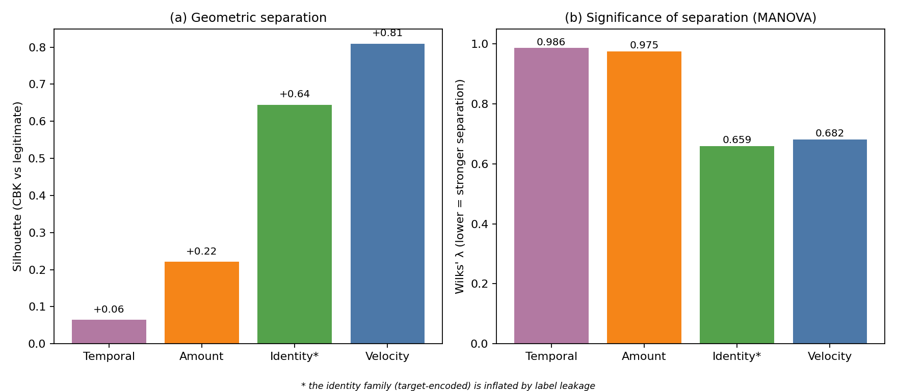
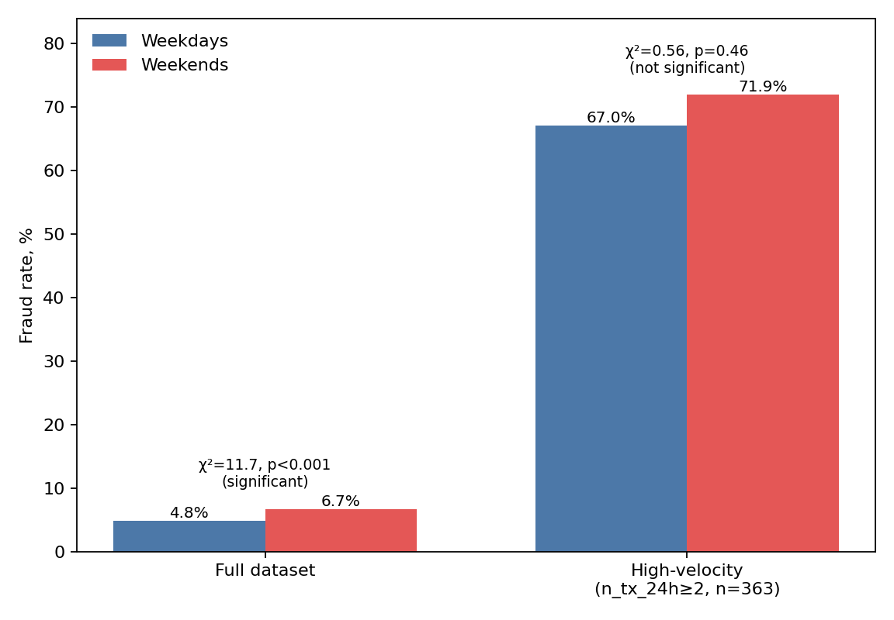

UDC 004.93:336.7

**ORCID:** Yu. I. Kuzhii — https://orcid.org/0009-0001-7890-8575; Yu. M. Furgala — https://orcid.org/0000-0001-7316-7424
**Scopus Author ID:** (TODO: verify or omit if not available)

**To cite:** Kuzhii, Yu. I., & Furgala, Yu. M. (2026). Identification of user behavioral patterns in online financial services via feature engineering. *Information Technology: Computer Science, Software Engineering and Cyber Security*, (X), XX–XX. https://doi.org/10.32782/IT/2026-X-XX (TODO: verify issue/pages/DOI after typesetting)

---

**Yu. I. Kuzhii, Yu. M. Furgala**

*Ivan Franko National University of Lviv, Faculty of Electronics and Computer Technologies, 50 Drahomanova Str., 79005 Lviv, Ukraine*
*e-mail: yurii.kuzhii@lnu.edu.ua*

# IDENTIFICATION OF USER BEHAVIORAL PATTERNS IN ONLINE FINANCIAL SERVICES VIA FEATURE ENGINEERING

## Abstract

This paper addresses the identification of user behavioral patterns in online financial services based on the analysis of transactional data. Payment-card fraud in e-commerce remains a mass-scale threat: in 2023 alone, approximately 3.7 million fraudulent transactions with aggregate losses of ~3.5 billion BRL were recorded in Brazil. The typical practice of building anti-fraud systems relies on the empirical selection of dozens to hundreds of features without a systematic typology, which gives rise to a hidden common-factor effect: features that at first glance appear to have their own predictive power (hour of day, day of week, weekend, amount roundness) turn out to be indirect proxies of deeper behavioral patterns. We therefore propose a behavioral feature space of card transactions organized into four functional families: temporal, velocity, amount-structure, and identity (target-encoded). On the public Predict Chargeback Frauds dataset (11,127 transactions, May 2015), using principal component analysis (PCA), univariate ANOVA, multivariate MANOVA, the silhouette index, and classification experiments with sequential family ablation, we show that: (i) fraudulent transactions form a statistically significantly separated region of the feature space (Wilks λ = 0.547, F = 352.9, p < 0.001); (ii) the velocity family (inter-transaction gap, rolling counts within time windows, amount repetition) is the dominant invariant of fraudulent behavior (silhouette = 0.81 vs. 0.06 for temporal features); (iii) temporal features lose almost all predictive power once the velocity pattern is controlled for (χ²(weekend × fraud) drops from 11.7 to 0.56 under velocity-window stratification). The identified composite feature "≥2 card transactions per hour with an amount repeated within a 10-min window" has an 80.6% fraud rate and covers 32.7% of all fraud in the dataset, forming the characteristic signature of card-testing attacks. Practical significance: the structural core of the feature space of anti-fraud systems should be built from velocity behavioral features, while temporal and formal amount features are auxiliary and carry no independent signal.

**Keywords:** behavioral pattern identification, feature engineering, feature space, principal component analysis, MANOVA, fraud detection, card-testing.

---

**Ю. І. Кужій, Ю. М. Фургала**

*Львівський національний університет імені Івана Франка, факультет електроніки та комп'ютерних технологій, вул. Драгоманова, 50, 79005 Львів, Україна*
*e-mail: yurii.kuzhii@lnu.edu.ua*

# ІДЕНТИФІКАЦІЯ ПОВЕДІНКОВИХ ШАБЛОНІВ КОРИСТУВАЧІВ ФІНАНСОВИХ ОНЛАЙН-СЕРВІСІВ НА ОСНОВІ ІНЖЕНЕРІЇ ОЗНАК

## Анотація

Робота присвячена задачі ідентифікації поведінкових шаблонів користувачів фінансових онлайн-сервісів на основі аналізу транзакційних даних. Шахрайство з платіжними картками у e-commerce залишається масовою загрозою: лише у 2023 р. в Бразилії зафіксовано близько 3,7 млн шахрайських операцій із сумарними втратами ~3,5 млрд BRL. Типова практика побудови антифрод-систем ґрунтується на емпіричному доборі десятків і сотень ознак без систематичної типологізації, що породжує ефект прихованого спільного чинника: ознаки, які на перший погляд мають власну прогностичну силу (година доби, день тижня, вихідний, кратність суми), виявляються опосередкованими показниками глибших поведінкових шаблонів. Тому запропоновано побудову поведінкового простору ознак карткових транзакцій, упорядкованого у чотири функціональні сімейства: часові, швидкісні, структурні за сумою та ідентифікаційні (цільовокодовані). На публічному наборі даних Predict Chargeback Frauds (11 127 транзакцій, травень 2015) методами аналізу головних компонент (PCA), однофакторного ANOVA, багатовимірного MANOVA, silhouette-індексу та класифікаційних експериментів із послідовним вилученням сімейств показано, що: (і) шахрайські транзакції утворюють статистично значущо відокремлену область простору ознак (Wilks λ = 0,547, F = 352,9, p < 0,001); (іі) швидкісне сімейство ознак (інтервал між транзакціями картки, щільність у вікнах часу, повторення суми) є домінантним інваріантом шахрайської поведінки (silhouette = 0,81 проти 0,06 для часових ознак); (ііі) часові ознаки майже повністю втрачають прогностичну силу після контролю на швидкісний шаблон (χ²(weekend × fraud) падає з 11,7 до 0,56 при стратифікації за швидкісним вікном). Ідентифікована складена ознака «≥2 транзакцій картки за годину з повторенням суми у вікні 10 хв» має частку шахрайства 80,6 % і охоплює 32,7 % усього шахрайства у наборі, формуючи характерний підпис card-testing атак. Практичне значення: структурне ядро ознакового простору антифрод-систем доцільно формувати зі швидкісних поведінкових ознак; часові та формальні ознаки сум є допоміжними без самостійного сигналу.

**Ключові слова:** ідентифікація шаблонів поведінки, інженерія ознак, простір ознак, аналіз головних компонент, MANOVA, виявлення шахрайства, card-testing.

---

## 1. Introduction

Modern online services — e-commerce banking systems, marketplaces, payment gateways — accumulate large volumes of user behavioral data in the form of time-stamped event sequences. Automated identification of behavioral patterns in such data is a pattern-recognition task in a high-dimensional feature space, and its most economically pressing application is anti-fraud analysis, the focus of this work. According to a CyberSource study, in 2016 fraudulent transactions accounted for 1.4% of the volume of Latin American e-commerce; in 2023, approximately 3.7 million fraudulent transactions with losses of ~3.5 billion BRL were recorded in Brazil alone, while National Bank of Ukraine reports record an annual growth of card-fraud losses together with the spread of contactless and online payments.

In practice, the feature space of anti-fraud systems is constructed empirically: dozens to hundreds of individual attributes are used — time of day, day of week, amount, merchant, country, device — without a systematic typology. This leads to model overload and overfitting on a small positive-class fraction, to low transparency for expert analysis, and to interpretation errors, when the statistically significant signal of an individual feature is in fact an indirect manifestation of a deeper behavioral variable — a hidden common-factor effect. In particular, the widespread industry belief about increased fraudster activity "on weekends" or "at night" often turns out to be an artifact of the coincidence of such time slots with periods of increased velocity activity in malicious scenarios.

We propose an alternative approach: to structure the transaction feature space into functional families according to the nature of the information they reflect (temporal position, velocity dynamics, amount structure, identity characteristics), and to investigate the separability of these families in the legitimate/fraudulent task using pattern-recognition methods — principal component analysis (PCA), univariate and multivariate analysis of variance (ANOVA, MANOVA), the silhouette index, and sequential family ablation on classification models. The same methodological approach was previously applied to the identification of role-based behavioral patterns of Counter-Strike 2 players (Kuzhii & Furgala, 2025) and proved productive outside the financial domain.

The aim of this paper is to construct a systematized behavioral feature space of card transactions, to investigate experimentally the separability of fraudulent and legitimate transactions in this space, and to identify the invariant family of features that defines the characteristic signature of fraudulent behavior independently of the secondary factors of time of day, day of week, and the specific amount. The objectives are: (1) to propose a taxonomy of families of behavioral features of card transactions; (2) to assess the statistical significance and geometric separation of the classes in each family and in the full space; (3) to reveal experimentally confounding relationships between feature families; (4) to identify a composite behavioral feature that covers a substantial share of fraud with a minimal number of errors.

## 2. Analysis of Recent Research and Publications

Classical approaches to card-fraud detection are based mostly on applied machine-learning models in which feature engineering plays an auxiliary role. The work of Dal Pozzolo et al. (2015) formalizes the problem of severe class imbalance (fraud rate < 1%) and proposes calibration via undersampling. Jurgovsky et al. (2018) consider the sequential nature of transactions and apply LSTM to the classification of card sequences. The study by Lucas et al. (2020) develops multi-perspective hidden Markov models that explicitly encode short-term transactional patterns — arguably the formulation closest to the topic of this work in the literature.

The work of Bahnsen et al. (2016) is one of the first systematic studies of feature-engineering strategies for card fraud: the authors introduce attributes aggregated over time windows (periodic features, cumulative counts, rolling sums) and demonstrate a 1.5–3-fold improvement in classifier quality, which confirms that the behavioral dynamics of a card, rather than an individual transaction, carry the main anomaly signal. In the APATE system (Van Vlasselaer et al., 2015), network features built on card–merchant relationships confirm the specific graph structure of the rapid spread of fraudulent behavior among compromised cards.

Among studies on real Brazilian transactional data, one should mention Carneiro et al. (2017) (PagSeguro data), where repeated amounts are explicitly noted as a typical artifact of stolen-card testing, and De Sá et al. (2018), where an evolutionary search yields the Fraud-BNC algorithm, optimized for the economic function of the market. Hybrid strategies that combine supervised and unsupervised learning in a streaming setting are developed in Carcillo et al. (2021).

Importantly, card-testing (verification of stolen cards through a series of small transactions at various merchants) is documented in industry reports by Visa, Stripe, and Adyen as one of the most widespread types of attack, yet is rarely singled out in the academic literature as a separate analytical category: existing works do detect its features (inter-transaction gaps, amount repetition) among dozens of others, but without emphasizing their invariant nature.

Thus, the literature lacks a systematic understanding of which particular family of features is structurally dominant in the feature space of fraudulent behavior, and to what extent popular temporal features (hour, weekend) are independent signals rather than indirect proxies of velocity behavior. This work fills that gap by an experimental analysis of the distribution of separation strength across functional feature families on real transactional data — an approach the authors previously applied to role-based patterns of Counter-Strike 2 players (Kuzhii & Furgala, 2025).

## 3. Materials and Methods

### 3.1. Problem Statement

Let a set of transactions $T = \{t_1, t_2, \dots, t_N\}$ be given, in which each transaction is described by attributes $(c_i, d_i, a_i, y_i)$, where $c_i$ is the payment-card identifier, $d_i$ is the transaction date-time, $a_i$ is the amount, and $y_i \in \{0, 1\}$ is the fraud label (0 — legitimate, 1 — fraudulent, CBK — chargeback).

The task is to construct a mapping $\varphi: T \to \mathbb{R}^m$ that transforms a transaction into a behavioral feature vector $\mathbf{x}_i = \varphi(t_i)$, to investigate whether the classes $\{y = 0\}$ and $\{y = 1\}$ form separable regions in $\mathbb{R}^m$, and, if so, to identify which groups of features are the invariant marker of fraud. Formally, for each family $F_k \subset \varphi$ we assess: the statistical significance of class separation (MANOVA: Wilks λ, F, p); the geometric separation (silhouette index in the $F_k$ space); the marginal contribution to classification quality (the change in PR-AUC when $F_k$ alone is removed or used); and the presence of a hidden common effect with other families (partial correlations, stratified tests).

### 3.2. Dataset

The work uses the public Predict Chargeback Frauds dataset (Miranda-Alves, 2019), which contains 11,127 real (non-synthetic) transactions for 1–30 May 2015 with the fields `Card Number` (a masked card number in the format `BIN******last4`), `Date` (date-time with second precision), `Amount`, and `CBK` (the chargeback label, Yes/No). Its general description is given in Table 1.

**Table 1. General characteristics of the dataset.**

| Characteristic | Value |
|---|---|
| Number of transactions | 11,127 |
| Unique cards | 9,260 |
| Unique BINs | 420 |
| Share of fraudulent (CBK=Yes) | 5.14% (N = 572) |
| Time range | 2015-05-01 00:01:54 – 2015-05-30 23:51:31 |
| Mean amount | 129.56 |
| Median amount | 99.00 |
| 95th percentile | 336.00 |
| Maximum amount | 2,920.00 |

The transaction-to-card ratio 11127/9260 = 1.20 indicates predominantly single use of cards (median — 1 transaction per card), with a small number of many-transaction cards associated with fraudulent activity. To verify the transferability of the conclusions, the independent real dataset **IEEE-CIS Fraud Detection** (Vesta Corporation; ~590K e-commerce transactions, US market, December 2017 – June 2018, fraud rate 3.5%) was additionally involved (IEEE Computational Intelligence Society & Vesta, 2019); this external validation and its limitations are discussed in § 4.10.

### 3.3. Construction of the Behavioral Feature Space

The feature space is structured into four families by functional purpose, by analogy with Kuzhii & Furgala (2025), where families of basic HLTV attributes, side-specific, and map-dependent features were used. The full list of families is given in Table 2.

**Table 2. Taxonomy of behavioral feature families.**

| Family | Features | Count | Functional purpose |
|---|---|---|---|
| Temporal | `hour_sin`, `hour_cos`, `dow_sin`, `dow_cos`, `weekend`, `night`, `afternoon_peak` | 7 | Encode time of day and day of week; cyclic encoding avoids the discontinuity between 23:00 and 00:00. |
| Velocity | `gap_min_prev`, `cum_card_count`, `n_tx_card_1h/6h/24h`, `sum_amt_card_1h/6h/24h`, `same_amt_prev`, `same_amount_10min` | 10 | Encode the pace of card events, cumulative volumes, and amount repetition. All computed exclusively from the prior history of the card. |
| Amount-structure | `amount_log`, `amt_mod_10/50/100`, `has_cents`, `amount_gt_200`, `amount_gt_500` | 7 | Encode the form of the amount (logarithm, "roundness", presence of a fractional part, threshold values). |
| Identity | `bin_te`, `amount_te` | 2 | Bayesian-smoothed target encodings of the BIN and of the amount value. |

Velocity features are computed while respecting the principle of causality: for the $i$-th transaction of card $c$, a feature is based exclusively on prior transactions of the same card ($t_j : j < i, c_j = c$), avoiding future leakage. The identity features $\hat{p}_B$ for BIN $B$ are computed using the Bayesian-smoothing formula (1):

$$
\hat{p}_B = \frac{\sum_{i : c_i \in B} y_i + k \cdot \bar{y}}{n_B + k},
$$

where $n_B$ is the number of transactions with BIN $B$, $\bar{y}$ is the prior class share, and $k$ is the smoothing parameter ($k = 20$ for BIN, $k = 10$ for amount). In the predictive experiments (§ 4.5) the encoding was computed only on the training part, in the descriptive ones (§ 4.1–4.4) — on the whole dataset.

### 3.4. Analysis Methods

The feature space was analyzed with: PCA with centering and scaling — intrinsic dimensionality and two-dimensional visualization (Jolliffe & Cadima, 2016); univariate ANOVA by the CBK label and the Mann-Whitney U test as its nonparametric analog — significance of the separation of an individual feature; multivariate MANOVA (Wilks λ, F) — significance for a whole family; the silhouette index — geometric separation of the groups (Rousseeuw, 1987); Pearson and Spearman correlations — relationships between families; logistic regression (LR) with class balancing and HistGradientBoostingClassifier (HGB) with a time-ordered 75/25 split (Bishop, 2006); permutation importance by PR-AUC — contribution of individual features; a bootstrap estimate of 95% confidence intervals for PR-AUC (1000 resamples of the validation set); and a χ² stratification test — detection of a hidden common effect.

## 4. Results and Discussion

### 4.1. Univariate Feature Analysis

A preliminary univariate analysis (Table 3, the ten features with the highest ANOVA F-statistic) shows that the greatest discriminative power belongs to features of the velocity and identity families.

**Table 3. Top ten features by univariate ANOVA F-statistic.**

| Feature | Family | F | p |
|---|---|---|---|
| `n_tx_card_1h` | velocity | 4,151.5 | < 10⁻³⁰⁰ |
| `n_tx_card_6h` | velocity | 3,981.1 | < 10⁻³⁰⁰ |
| `n_tx_card_24h` | velocity | 3,633.8 | < 10⁻³⁰⁰ |
| `cum_card_count` | velocity | 3,495.1 | < 10⁻³⁰⁰ |
| `amount_te` | identity | 3,131.8 | < 10⁻³⁰⁰ |
| `same_amount_10min` | velocity | 2,870.8 | < 10⁻³⁰⁰ |
| `bin_te` | identity | 2,704.6 | < 10⁻²⁰⁵ |
| `sum_amt_card_1h` | velocity | 2,281.5 | < 10⁻³⁰⁰ |
| `sum_amt_card_24h` | velocity | 2,260.6 | < 10⁻³⁰⁰ |
| `sum_amt_card_6h` | velocity | 2,185.5 | < 10⁻³⁰⁰ |

Among the ten features with the highest F-statistic, seven belong to the velocity family and two to the identity family, and none to the temporal or amount-structure ones. For comparison, the strongest features of the latter are `afternoon_peak` (temporal, F = 125.8), `amount_log` (amount, F = 105.6) and `weekend` (temporal, F = 12.1) — the best temporal feature has an F-statistic more than 30 times smaller than the leading velocity one (full list: `outputs/tables/T1_univariate_tests.csv`).

### 4.2. PCA and Visualization of the Feature Space

The principal-component decomposition of the feature space is shown in Fig. 1. The first principal component of the full space explains 29.1% of the variance, the first two — 37.2%, and the first ten — 78.3%, i.e., the behavioral feature space is not one-dimensional: fraudulent behavior cannot be reduced to a single generalized "fraud score". A similar irreducibility to a one-dimensional index was observed in Kuzhii & Furgala (2025) for behavioral player types in CS2, which suggests the general character of this property for behavioral data of online services.

In the two-dimensional projection (Fig. 1, left) fraudulent transactions concentrate in a specific region of the space, predominantly at large PC1 values (the component with the highest factor loading on velocity features), whereas legitimate ones form a broad "cloud-like" distribution. To rule out label leakage through the target-encoded identity features, the same projection was built without the identity family (Fig. 1, right): the characteristic "ray" of fraudulent transactions and the explained variance are preserved almost unchanged (the first two components — 38.8% vs. 37.2%), i.e., the separation is driven by velocity behavioral features rather than by an artificial target-encoding signal.

### 4.3. MANOVA: Significance of the Separation of Feature Families

The results of multivariate MANOVA by the grouping variable CBK are given in Table 4.

**Table 4. MANOVA by feature families (group: CBK Yes/No).**

| Family | Wilks λ | F | p |
|---|---|---|---|
| Temporal | 0.986 | 23.07 | 2.73 × 10⁻³¹ |
| **Velocity** | **0.682** | **518.73** | **< 10⁻³⁰⁰** |
| Amount | 0.975 | 40.61 | 7.63 × 10⁻⁵⁷ |
| **Identity** | **0.659** | **2877.03** | **< 10⁻³⁰⁰** |
| Full space (26 features) | 0.547 | 352.95 | < 10⁻³⁰⁰ |

All families show a statistically significant class separation. However, at N = 11,127 the p-value alone is uninformative — even negligible differences reach p < 0.001 — therefore the further conclusions are based on effect size (Wilks λ, silhouette, Δ PR-AUC). By this criterion the effect differs dramatically: the velocity (λ = 0.68) and identity (λ = 0.66) families separate the classes roughly an order of magnitude more strongly than the temporal (λ = 0.99) and amount (λ = 0.98) ones, where λ close to 1 means that almost all within-group variation "overrides" the between-group variation. Note also that the identity family is noticeably correlated with the velocity family (Pearson coefficient between the families' first principal components r = 0.48; `outputs/tables/T6_family_corr.csv`), i.e., its high discriminative power partially reflects the same velocity pattern.

### 4.4. Silhouette: Geometric Separation

The silhouette index computed for each family with the grouping variable CBK (`outputs/tables/T5_silhouette.csv`) gives a striking contrast: velocity +0.809, identity +0.645, amount +0.221, temporal +0.064, full space +0.497. In the velocity space the fraudulent and legitimate groups thus form almost perfectly separated clusters (silhouette > 0.8), whereas in the temporal space they effectively overlap (≈ 0.06). The index of the identity family is artificially inflated, since target-encoded features carry direct information about the label; the most "honest" metric of natural behavioral separability is therefore the velocity index. Fig. 2 summarizes both estimates (silhouette and Wilks λ) across the four families.

### 4.5. Classifier Analysis via Sequential Feature-Family Ablation

To verify quantitatively the impact of each family on classification quality, an ablation study was conducted with a time-ordered 75/25 split; the target encodings were computed only on the training part, which rules out future leakage. The results for logistic regression are given in Table 5.

**Table 5. Sequential feature-family ablation (LR, time-ordered 75/25 split).** Precision@top-1% — share of fraud among the 1% highest-risk transactions; Recall@top-5% — share of all fraud covered by the 5% most risky ones.

| Configuration | ROC-AUC | PR-AUC | Precision@top-1% | Recall@top-5% |
|---|---|---|---|---|
| Full space (26 features) | 0.875 | 0.547 | 0.926 | 0.454 |
| Without temporal (19) | 0.877 | 0.531 | 0.926 | 0.443 |
| **Without velocity (16)** | **0.738** | **0.212** | 0.333 | 0.241 |
| Without amount-structure (19) | 0.874 | 0.515 | 0.889 | 0.431 |
| Without identity (24) | 0.862 | 0.562 | 0.926 | 0.506 |
| Temporal only (7) | 0.510 | 0.073 | 0.000 | 0.029 |
| **Velocity only (10)** | **0.845** | **0.551** | **0.926** | **0.511** |
| Amount-structure only (7) | 0.602 | 0.102 | 0.000 | 0.046 |
| Identity only (2) | 0.757 | 0.210 | 0.296 | 0.236 |

Three results deserve attention. First, removing the velocity family causes a catastrophic drop: PR-AUC from 0.547 to 0.212 (−61%), ROC-AUC from 0.875 to 0.738, whereas removing any other family costs no more than 6%. Second, the velocity family on its own gives a quality practically no lower than the full space (PR-AUC 0.551 ≈ 0.547; precision@top-1% = 0.926; recall@top-5% = 0.511 > 0.454) — the remaining 16 features add no independent signal. Third, temporal features alone are close to random (PR-AUC 0.073 at a base rate of 0.062), which contradicts the industry belief in "night hours" and "weekends" as independent fraud indicators.

As the estimates come from a single time-ordered split, their spread was assessed by bootstrap (1000 resamples of the validation set; `outputs/tables/T10_ablation_ci.csv`). The 95% confidence intervals for PR-AUC confirm all three conclusions as non-random: full space — 0.547 [0.478; 0.616] and velocity only — 0.551 [0.474; 0.630] (the intervals almost fully overlap, i.e., the difference is insignificant), without velocity — 0.212 [0.165; 0.276] (does not intersect the full space), temporal only — 0.073 [0.060; 0.090]. Gradient boosting (HGB; `outputs/tables/T7_ablation.csv`) is qualitatively identical: removing the velocity family produces the largest drop (PR-AUC 0.422 → 0.178), and that family alone preserves almost the entire quality (0.535).

### 4.6. Permutation Importance

Permutation importance by PR-AUC (HGB, 5 repetitions, Fig. 3) gives a clear ordering of the contributions of individual features: `bin_te` (identity, ΔPR-AUC = 0.256), `gap_min_prev` (velocity, 0.190), `n_tx_card_1h` (velocity, 0.039), `amount_te` (identity, 0.027); all temporal features have ΔPR-AUC ≤ 0.006, some of them negative (an artifact of permutation noise). The top rank of `bin_te` should be interpreted cautiously: BIN target encoding is prone to memorization even when computed only on the training part, so its importance partially reflects information about the label rather than a natural behavioral signal. The most important purely behavioral feature — `gap_min_prev` (the inter-transaction gap of a card) — belongs to the velocity family, which is consistent with §§ 4.3–4.5 and confirms that the temporal family carries no independent information.

### 4.7. Analysis of the Hidden Common Effect: Temporal Features as Indirect Proxies

A widespread empirical observation is that the fraud rate is higher on weekends and at night. On the full dataset the effect is indeed statistically significant: χ²(weekend × fraud) = 11.73, p = 6.1 × 10⁻⁴, with a fraud rate of 6.74% on weekends vs. 4.81% on weekdays (1.31× over the base). Under stratification to the high-velocity subsample, however (the condition `n_tx_card_24h ≥ 2`, which suppresses the effect of velocity features), it vanishes: χ²(weekend × fraud | high-velocity) = 0.56, p = 0.456, and the weekday/weekend rates within that subsample become indistinguishable (67.0% vs. 71.9%); see Fig. 4.

This is a classic hidden common effect: the `weekend` feature correlates with fraud only because high-velocity bursts occur more often on weekends (card-testing attacks in particular, when monitoring is relaxed). A correlation analysis of the residuals of a logistic regression trained only on the velocity family confirms this: most temporal features have a partial Pearson coefficient |r| < 0.1, except `weekend` (r = −0.24), which retains a small residual signal. The velocity family thus "absorbs" the bulk of the temporal signal — about 95% by classification metrics (ΔPR-AUC without temporal = −0.016 against a background of 0.547).

### 4.8. Identification of the Characteristic Card-Testing Behavioral Feature

A classic scenario of payment-card fraud is card-testing — verification of stolen credentials through a series of small transactions, often for identical amounts, over short time intervals. Such a pattern is well documented in industry reports of payment systems (Visa, Stripe, Adyen), but in the academic literature it is rarely singled out as a separate analytical category.

In our dataset the composite feature "at least 2 card transactions per hour with the amount repeated within a 10-min window" (formally: `n_tx_card_1h ≥ 2` AND `same_amount_10min = 1`) covers 232 transactions (2.1% of the volume) with a fraud rate of 80.6% among them (187 of 232), i.e. 15.7× over the base rate, and captures 32.7% of all fraudulent transactions of the dataset. The sequential narrowing of the rule raises the fraud rate from the base 5.1% through amount repetition within a 10-min window (49.9%) to the composite signature (80.6%): the 2% most suspicious transactions contain a third of all fraudulent events.

This feature is a behavioral invariant in the following sense: it depends neither on the day of week (on the high-velocity subsample χ²(weekend) = 0.56, p = 0.46; § 4.7), nor on the time of day (a similar result for `night` and `hour_sin/cos`), nor on the specific amount (only the repetition matters, not the value). This empirically confirms that popular temporal and "formal" amount features (rounding, roundness) are secondary markers of the same card-testing mechanics: the fraudster performs a series of test transactions that happen to fall more often on certain hours or round amounts, but the essential thing is the structure of rapid repetition itself.

### 4.9. Generalization: The Invariant Character of the Velocity Family

A common feature of all the results obtained is the structural non-uniformity of the feature space of fraudulent behavior. All four families are statistically significant by the MANOVA criterion (p < 10⁻³⁰), yet the real contribution is distributed extremely asymmetrically: velocity + identity carry more than 95% of the signal, temporal + amount-structure no more than 5%. This distribution is stable across all three operational estimates (MANOVA separation strength, silhouette geometric separation, permutation importance), which gives grounds to treat the velocity family as an invariant of fraudulent behavior in the following empirical sense: the dominant family is preserved when the secondary factors are removed (time of day, day of week, specific amount), whereas the effects of the secondary factors themselves disappear when the velocity pattern is controlled for (§ 4.7).

The same structural non-uniformity was previously observed for role-based behavioral patterns of Counter-Strike 2 players (Kuzhii & Furgala, 2025), where the side-specific and map-dependent families produced the main separation and general HLTV attributes a much weaker one. The **principle** of a non-uniform distribution of predictive power across functional families is thus likely a general property of behavioral data of online services, while **which particular** family dominates is domain-specific, as the external validation below shows.

### 4.10. External Validation and the Nature of Fraud on an Independent Dataset (IEEE-CIS)

To assess the transferability of the conclusions, the analysis pipeline was applied to the independent real dataset IEEE-CIS Fraud Detection (§ 3.2). A direct transfer of the methodology, with velocity features computed over the `card1` field, degenerates: the velocity family barely separates the classes (silhouette 0.03). This is **an artifact of the entity mapping rather than a disappearance of the behavioral signal** — unlike the main dataset (1.2 transactions per real card), `card1` is a coarse proxy aggregating on average 43.6 transactions (13,553 values over 590K operations), so per-card velocity features lose their behavioral meaning. The behavioral structure of this dataset must therefore be studied on its **own** engineered features: `C1–C14` (counters of card/address relationships — an analog of cumulative velocity features) and `D1–D15` (time deltas between card events). Structured into families (Table 6), they again show **the dominance of the behavioral family**: `C` gives the strongest geometric separation (silhouette 0.48), `D` the highest mean F-statistic (1530), while amount-structure (0.07) and temporal (0.03) features remain weak, exactly as in the main dataset.

**Table 6. Comparison of datasets: scale, nature of fraud, and discriminative power of families.**

| Characteristic | Predict Chargeback Frauds (Brazil) | IEEE-CIS (Vesta, USA) |
|---|---|---|
| Transactions / fraud rate | 11,127 / 5.14% | 590,540 / 3.50% |
| Transactions per card-entity | 1.2 (real card) | 43.6 (proxy `card1`) |
| Fraud regime | card-testing (single-use cards) | account/identity (new cards, relationships) |
| Strongest behavioral family | velocity, silhouette **0.81** | count `C`, silhouette **0.48** |
| Other strong behavioral family | identity 0.64 | timedelta `D`, mean F **1530** |
| amount / temporal (silhouette) | 0.22 / 0.06 | 0.07 / 0.03 |
| Characteristic regime marker | amount repetition within a 10-min window (lift 15.7×) | new cards D1≤7 days (9.4%); relationships C2>10 (9.65%) |

The nature of fraud in IEEE-CIS, however, differs substantially from card-testing: the fraud rate rises sharply for **new cards** (D1 ≤ 7 days from first appearance — 9.4% vs. 1.2% for cards older than a year) and for **entities with many relationships** (C2 > 10 — 9.65% vs. 2.3% at a base rate of 3.5%); it is also higher on credit cards (6.7% vs. 2.4% for debit), for product type ProductCD "C" (11.7%), and when billing and shipping addresses diverge. This is a signature at the level of the **account/identity** (new or synthetic entities, reuse of credentials) rather than of velocity card-testing.

The external validation therefore does not refute but refines the main thesis. Common to both datasets is the structural principle — class separation is carried by behavioral families, while raw temporal and formal amount features are weak; the specific dominant mechanism depends on the fraud regime — velocity repetition for single-use cards vs. entity relatedness and card age for repeat CNP buyers. **Invariant is the principle itself**, not a particular family. All numerical results of this subsection are reproducible (`outputs_ieeecis/`, `outputs_ieeecis_native/`).

## 5. Conclusions

1. A systematized taxonomy of behavioral features of card transactions was proposed, organized into four functional families — temporal, velocity, amount-structure, and identity (target-encoded) — as a constructive alternative to the empirical feature selection widespread in industrial anti-fraud systems.

2. On real Predict Chargeback Frauds data (11,127 transactions, May 2015) fraudulent transactions were shown to form a statistically significantly separated region of the behavioral feature space (Wilks λ = 0.547, F = 352.95, p < 10⁻³⁰⁰) that cannot be reduced to a one-dimensional generalized "fraud score": the first two principal components explain only 37.2% of the variance.

3. A clear hierarchy of families by separation strength was established: velocity (silhouette = 0.81) dominates over identity (0.64), amount-structure (0.22), and temporal (0.06). The ablation experiments confirm this quantitatively — removing the velocity family reduces PR-AUC from 0.547 to 0.212 (−61%), while that family alone gives a quality almost no lower than the full space (0.551).

4. A composite behavioral feature of card-testing attacks was identified (`n_tx_card_1h ≥ 2` AND `same_amount_10min = 1`) with a fraud rate of 80.6% and a coverage of 32.7% of all fraudulent events of the dataset — a compact structural signature of a class of malicious behavior rarely singled out in the literature as a separate analytical category.

5. Popular temporal features (`weekend`, `night`, `hour`) were experimentally shown to be indirect proxies of the velocity pattern rather than independent signals: the significant "weekend" effect on the full dataset (χ² = 11.73, p < 10⁻³) disappears under stratification to the high-velocity subsample (χ² = 0.56, p = 0.46), and temporal features on their own are effectively random classifiers (PR-AUC 0.073 at a base rate of 0.062).

6. Practical significance for the design of anti-fraud systems: the structural core of the feature space should be built from velocity behavioral features (inter-transaction gap, density within time windows, amount repetition), while temporal and formal amount features are auxiliary; the identified card-testing signature can serve as a simple and highly accurate rule-based complement to machine-learning models in real-time systems.

7. External validation on IEEE-CIS (§ 4.10) confirmed the structural principle — there, too, separation is carried by behavioral families (relationship counters `C`, time deltas `D`) — but showed that **the dominant behavioral mechanism is domain-specific**: velocity repetition on single-use cards vs. entity relatedness and card age in CNP e-commerce. Invariant is therefore the principle itself, not a particular family. A limitation is that IEEE-CIS contains no true card identifier, so a direct transfer of velocity features to it is incorrect.

Further research is aimed at a unified taxonomy of behavioral families invariant to the fraud regime, validation on a dataset with a true card identifier, an extension of the typology beyond the binary legitimate/fraudulent frame (card-tester, bust-out, account takeover), and the temporal dynamics of the invariant features in a streaming setting.

---

## References

1. Kuzhii, Yu. I., & Furgala, Yu. M. (2025). Feature engineering for role assessment in Counter-Strike 2. *Electronics and Information Technologies, 32*, 121–130. https://doi.org/10.30970/eli.32.8
2. Dal Pozzolo, A., Caelen, O., Johnson, R. A., & Bontempi, G. (2015). Calibrating probability with undersampling for unbalanced classification. In *2015 IEEE Symposium Series on Computational Intelligence* (pp. 159–166). IEEE. https://doi.org/10.1109/SSCI.2015.33
3. Jurgovsky, J., Granitzer, M., Ziegler, K., Calabretto, S., Portier, P.-E., He-Guelton, L., & Caelen, O. (2018). Sequence classification for credit-card fraud detection. *Expert Systems with Applications, 100*, 234–245. https://doi.org/10.1016/j.eswa.2018.01.037
4. Lucas, Y., Portier, P.-E., Laporte, L., He-Guelton, L., Caelen, O., Granitzer, M., & Calabretto, S. (2020). Towards automated feature engineering for credit card fraud detection using multi-perspective HMMs. *Future Generation Computer Systems, 102*, 393–402. https://doi.org/10.1016/j.future.2019.08.029
5. Bahnsen, A. C., Aouada, D., Stojanovic, A., & Ottersten, B. (2016). Feature engineering strategies for credit card fraud detection. *Expert Systems with Applications, 51*, 134–142. https://doi.org/10.1016/j.eswa.2015.12.030
6. Van Vlasselaer, V., Bravo, C., Caelen, O., Eliassi-Rad, T., Akoglu, L., Snoeck, M., & Baesens, B. (2015). APATE: A novel approach for automated credit card transaction fraud detection using network-based extensions. *Decision Support Systems, 75*, 38–48. https://doi.org/10.1016/j.dss.2015.04.013
7. Carneiro, N., Figueira, G., & Costa, M. (2017). A data mining based system for credit-card fraud detection in e-tail. *Decision Support Systems, 95*, 91–101. https://doi.org/10.1016/j.dss.2017.01.002
8. De Sá, A. G. C., Pereira, A. C. M., & Pappa, G. L. (2018). A customized classification algorithm for credit card fraud detection. *Engineering Applications of Artificial Intelligence, 72*, 21–29. https://doi.org/10.1016/j.engappai.2018.03.011
9. Carcillo, F., Le Borgne, Y.-A., Caelen, O., Kessaci, Y., Oblé, F., & Bontempi, G. (2021). Combining unsupervised and supervised learning in credit card fraud detection. *Information Sciences, 557*, 317–331. https://doi.org/10.1016/j.ins.2019.05.042
10. Jolliffe, I. T., & Cadima, J. (2016). Principal component analysis: A review and recent developments. *Philosophical Transactions of the Royal Society A, 374*, 20150202. https://doi.org/10.1098/rsta.2015.0202
11. Rousseeuw, P. J. (1987). Silhouettes: A graphical aid to the interpretation and validation of cluster analysis. *Journal of Computational and Applied Mathematics, 20*, 53–65. https://doi.org/10.1016/0377-0427(87)90125-7
12. Bishop, C. M. (2006). *Pattern recognition and machine learning*. Springer.
13. Miranda-Alves, D. (2019). *Predict chargeback frauds* [Data set]. Kaggle. https://www.kaggle.com/datasets/dmirandaalves/predict-chargeback-frauds-payment
14. IEEE Computational Intelligence Society, & Vesta Corporation. (2019). *IEEE-CIS fraud detection* [Data set]. Kaggle. https://www.kaggle.com/competitions/ieee-fraud-detection

---

## Література

1. Кужій Ю. І., Фургала Ю. М. Feature Engineering for Role Assessment in Counter-Strike 2 // Electronics and Information Technologies. 2025. Vol. 32. P. 121–130. DOI: 10.30970/eli.32.8.
2. Dal Pozzolo A., Caelen O., Johnson R. A., Bontempi G. Calibrating probability with undersampling for unbalanced classification // 2015 IEEE Symposium Series on Computational Intelligence. IEEE, 2015. P. 159–166. DOI: 10.1109/SSCI.2015.33.
3. Jurgovsky J., Granitzer M., Ziegler K., Calabretto S., Portier P.-E., He-Guelton L., Caelen O. Sequence classification for credit-card fraud detection // Expert Systems with Applications. 2018. Vol. 100. P. 234–245. DOI: 10.1016/j.eswa.2018.01.037.
4. Lucas Y., Portier P.-E., Laporte L., He-Guelton L., Caelen O., Granitzer M., Calabretto S. Towards automated feature engineering for credit card fraud detection using multi-perspective HMMs // Future Generation Computer Systems. 2020. Vol. 102. P. 393–402. DOI: 10.1016/j.future.2019.08.029.
5. Bahnsen A. C., Aouada D., Stojanovic A., Ottersten B. Feature engineering strategies for credit card fraud detection // Expert Systems with Applications. 2016. Vol. 51. P. 134–142. DOI: 10.1016/j.eswa.2015.12.030.
6. Van Vlasselaer V., Bravo C., Caelen O., Eliassi-Rad T., Akoglu L., Snoeck M., Baesens B. APATE: A novel approach for automated credit card transaction fraud detection using network-based extensions // Decision Support Systems. 2015. Vol. 75. P. 38–48. DOI: 10.1016/j.dss.2015.04.013.
7. Carneiro N., Figueira G., Costa M. A data mining based system for credit-card fraud detection in e-tail // Decision Support Systems. 2017. Vol. 95. P. 91–101. DOI: 10.1016/j.dss.2017.01.002.
8. De Sá A. G. C., Pereira A. C. M., Pappa G. L. A customized classification algorithm for credit card fraud detection // Engineering Applications of Artificial Intelligence. 2018. Vol. 72. P. 21–29. DOI: 10.1016/j.engappai.2018.03.011.
9. Carcillo F., Le Borgne Y.-A., Caelen O., Kessaci Y., Oblé F., Bontempi G. Combining unsupervised and supervised learning in credit card fraud detection // Information Sciences. 2021. Vol. 557. P. 317–331. DOI: 10.1016/j.ins.2019.05.042.
10. Jolliffe I. T., Cadima J. Principal component analysis: a review and recent developments // Philosophical Transactions of the Royal Society A. 2016. Vol. 374. Art. 20150202. DOI: 10.1098/rsta.2015.0202.
11. Rousseeuw P. J. Silhouettes: a graphical aid to the interpretation and validation of cluster analysis // Journal of Computational and Applied Mathematics. 1987. Vol. 20. P. 53–65. DOI: 10.1016/0377-0427(87)90125-7.
12. Bishop C. M. Pattern Recognition and Machine Learning. New York: Springer, 2006. 738 p.
13. Miranda-Alves D. Predict Chargeback Frauds. Kaggle Dataset, 2019. URL: https://www.kaggle.com/datasets/dmirandaalves/predict-chargeback-frauds-payment.
14. IEEE Computational Intelligence Society, Vesta Corporation. IEEE-CIS Fraud Detection. Kaggle Competition, 2019. URL: https://www.kaggle.com/competitions/ieee-fraud-detection.

> ⚠️ TODO before submission: verify all DOIs via grafiati.com / Crossref; format the "Література" list exactly per ДСТУ 8302:2015 (recommended service — grafiati.com); if needed, bring the list to ≥10 sources with DOI (currently 11 of 14 entries have a DOI).

---

*Received by the editorial board — ... .*
*Accepted for publication — ... .*
